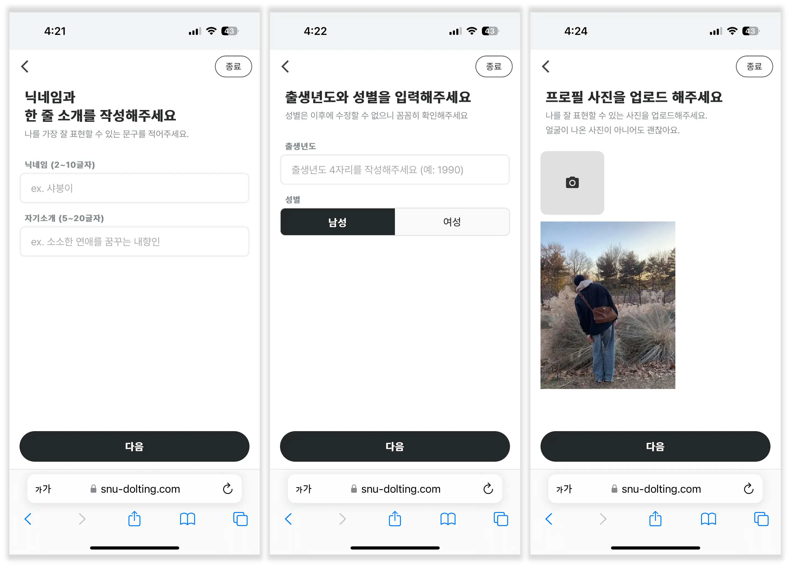
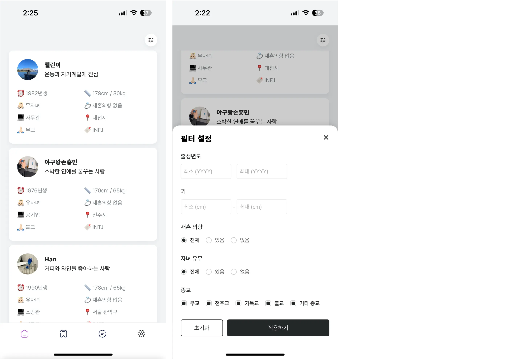
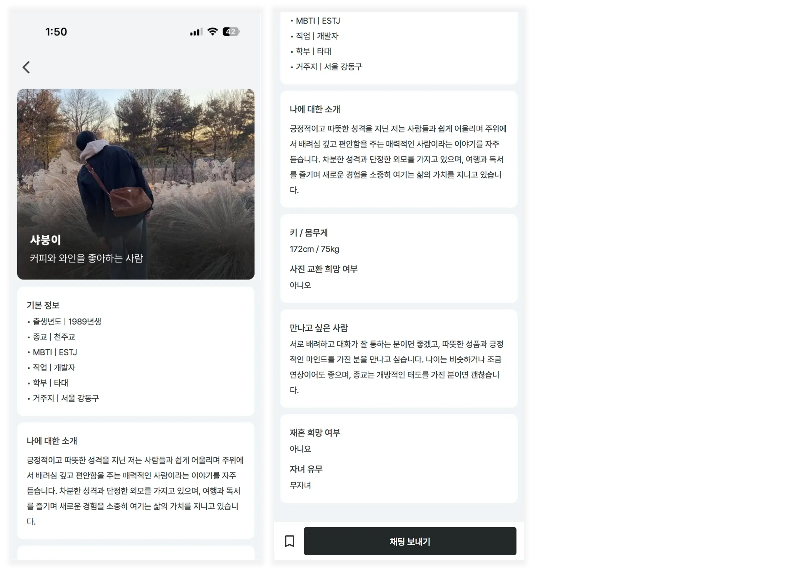
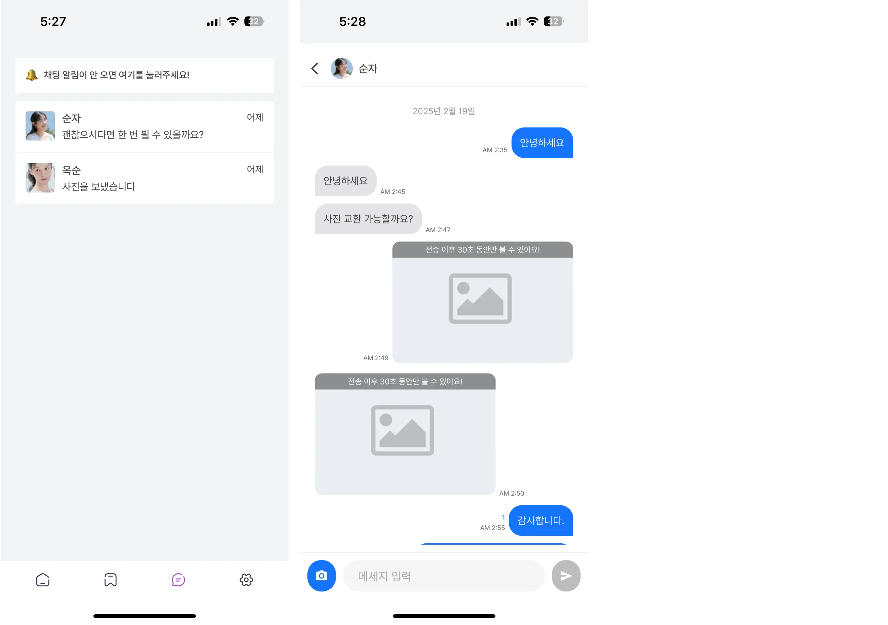

## 💜 스누돌팅
> 💡 서울대학교 동문 돌싱들을 위한 소개팅 앱입니다.

### ⚒️ 기술 스택
- __Frontend__: Next.js, TypeScript, React Query, vanilla-extract
- __Backend__: Supabase
- __Etc__: Vercel, Firebase Cloud Messaging, GitHub Actions, PWA

## 🔗 사이트 링크
__[🚀 실제 서비스 사이트](https://www.snu-dolting.com)__

__[🔎 데모 사이트 (로그인 없이 살펴보실 수 있습니다.)](https://www.snu-dolting-demo.store)__

## 🚀 주요 기능
### 1️⃣ 회원가입

### 2️⃣ 사용자 목록 조회

### 3️⃣ 프로필 조회

### 4️⃣ 채팅

